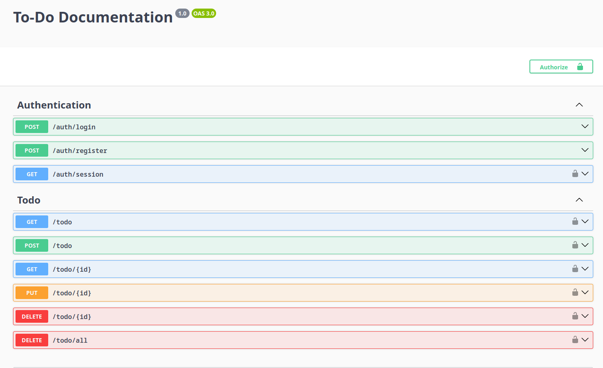
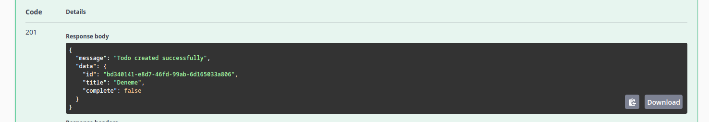
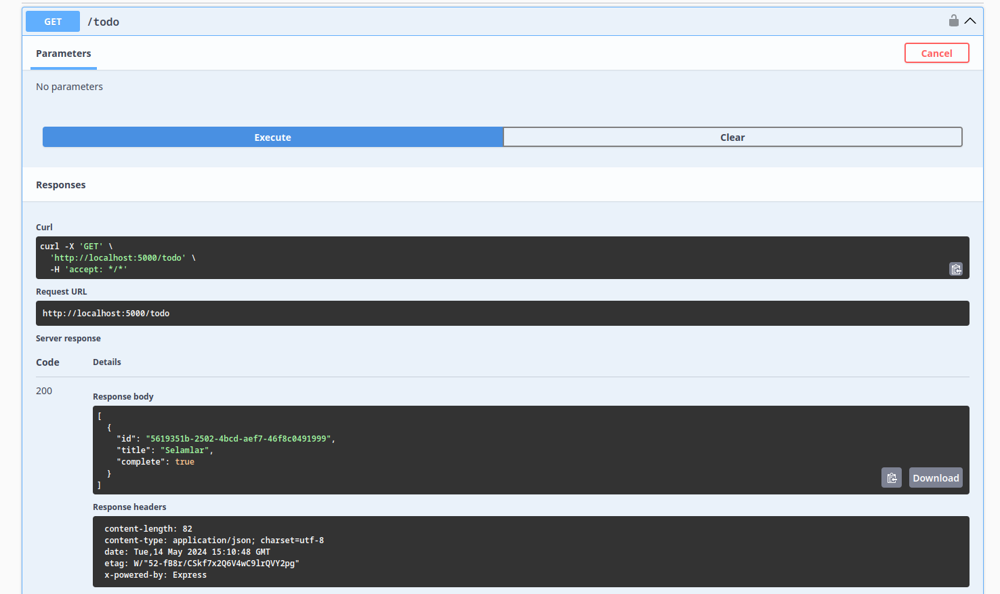
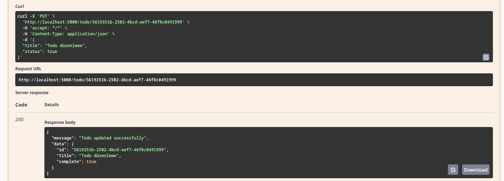
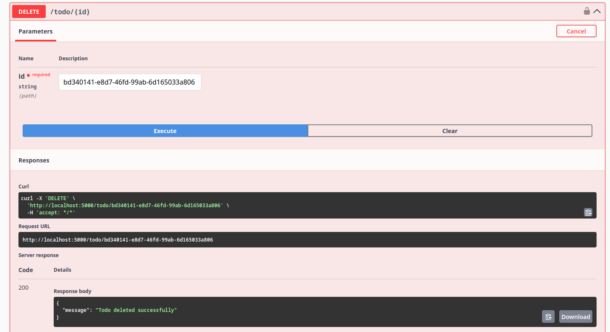

## Table of Contents

- [Tech Stack](#tech-stack)
- [Configuration](#configuration)
- [Installation](#installation)
  - [NPM](#npm)
  - [Yarn](#yarn)
  - [PNPM](#pnpm)
- [Directory Structure](#directory-structure)
- [Notes](#notes)
- [Screenshots](#screenshots)

## Tech Stack

- [NestJS](https://nestjs.com/)
- [TypeScript](https://www.typescriptlang.org/)
- [Postgres](https://www.postgresql.org/)
- [Redis](https://redis.io/)
- [Swagger](https://swagger.io/)

## Configuration

Edit the `.env` file in the root of the project to configure the server.
**Example .env file**:

```env
BACKEND_PORT=5000
SESSION_SECRET=secret

APP_NAME=authenticated-todo
NODE_ENV=development

DB_HOST=localhost
DB_PORT=5432
DB_USERNAME=postgres
DB_PASSWORD=postgres
DB_DATABASE=todo

REDIS_HOST=localhost
REDIS_PORT=6379
REDIS_PASSWORD=redis_password

```

## Installation

### NPM

```sh
npm install
```

<details>
  <summary>
    <b>🚧 Development Mode</b>
  </summary>

  ```sh
    npm run start:dev
  ```

</details>
<details>
  <summary>
    <b>⚡ Production Mode</b>
  </summary>

  ```sh
    npm run build
    npm run start:prod
  ```

</details>

### Yarn

```sh
yarn install
```

<details>
  <summary>
    <b>🚧 Development Mode</b>
  </summary>

  ```sh
    yarn start:dev
  ```

</details>
<details>
  <summary>
    <b>⚡ Production Mode</b>
  </summary>

  ```sh
    yarn build
    yarn start:prod
  ```

</details>

### Pnpm

```sh
pnpm install
```

<details>
  <summary>
    <b>🚧 Development Mode</b>
  </summary>

  ```sh
    pnpm start:dev
  ```

</details>
<details>
  <summary>
    <b>⚡ Production Mode</b>
  </summary>

  ```sh
    pnpm build
    pnpm start:prod
  ```

</details>

## Directory Structure

```sh
├── main.ts
├── app.module.ts
├── /api
│   └── /user
│       ├── /dto
│       ├── user.controller.ts
│       ├── user.module.ts
│       └── user.service.ts
├── /configs
├── /database
│   ├── database.module.ts
│   └── /entities
├── /decorators
│   ├── /auth
│   └── /validators
├── /errors
```

| File/Directory                      | Description                                             |
| ---------------------------------- | -------------------------------------------------------- |
| `app.module.ts`                    | Module that gathers all modules together                |
| `/Api`                             | Main folder for creating all endpoints                  |
| - `/api/user`                      | Example endpoint folder                                 |
| - `/api/user/dto`                  | DTO folder for the User module                          |
| `/Configs`                         | Folder for configuration files                          |
| `/Database`                        | Folder for the Database module                          |
| - `/database/entities`             | Folder for the database tables                          |
| - `/database/database.module.ts`   | TypeScript file for saving database tables              |
| `/Decorators`                      | Folder for decorator files                              |
| - `/decorators/validators`         | Folder for validation decorators                        |
| `/Errors`                          | Folder for error files                                  |

## Notes

- Used express session for authentication and store session in `Redis`.
- The reason that i use redis is because in the future it might need load balancing and redundancy. In that case it would be better to use redis for session management.
- Used class-validator for validation in DTOs.
- Used OpenAPI for swagger documentation. Swagger url is `/api`
- `TypeORM` is used for database management.
- Main database is `Postgresql`.

## Screenshots

Endpoint List


Example create response


Todo list response


Todo update


Todo delete

